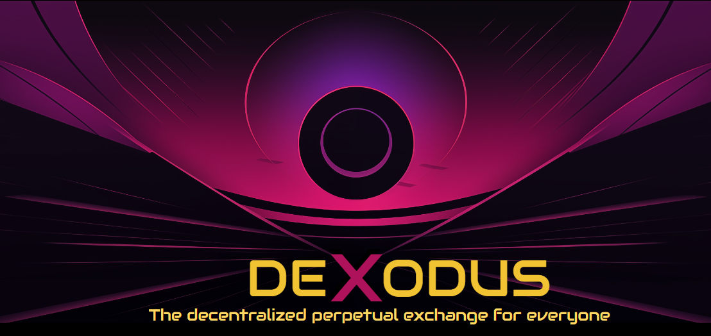
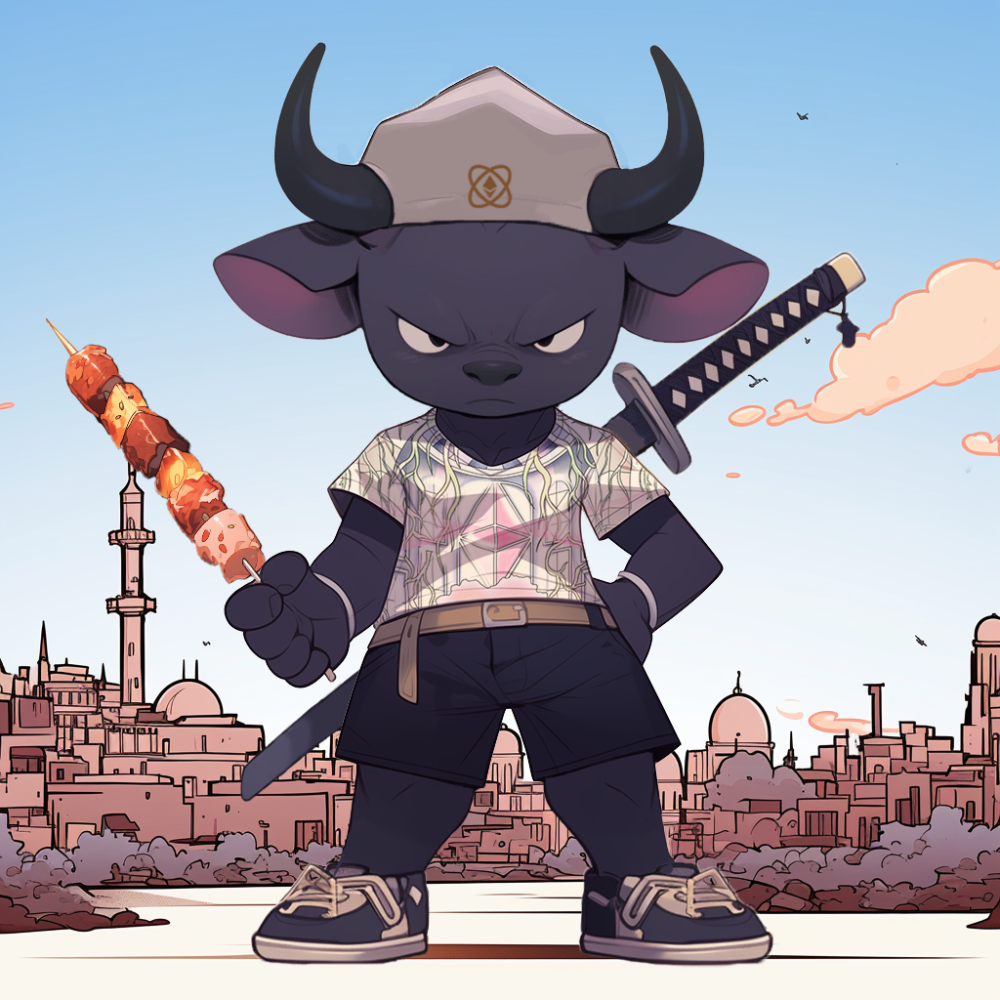

# DeXodus

---

DeXodus is the next generation decentralized perpetual exchange for everyone. This project was born out of sweat, blood and copious amounts of ayram during the legendary hackathon of ETH Global Istanbul 2023. 

We wanted to thank everyone who helped bring this event together and wish the best of luck to all our competitors who have shared this experience with us. We had an amazing time and we hope you all did as well.

To immortalize the event, we have developed a few unique traits (EtH Global beanie, t-shirt and shish kebab) for our NFT collection that will be airdropped exclusively to the first 40 users of our testnet deployment. We hope you like it and look forward to your feedback!

---

[Prize Submissions](#prize-submissions) •
[Important Links](#important-links)

---

# Prize Subsmissions

# Important Links
